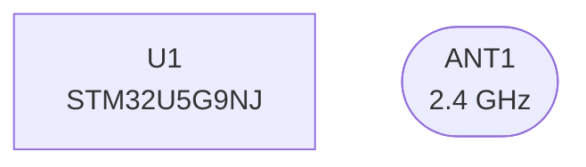
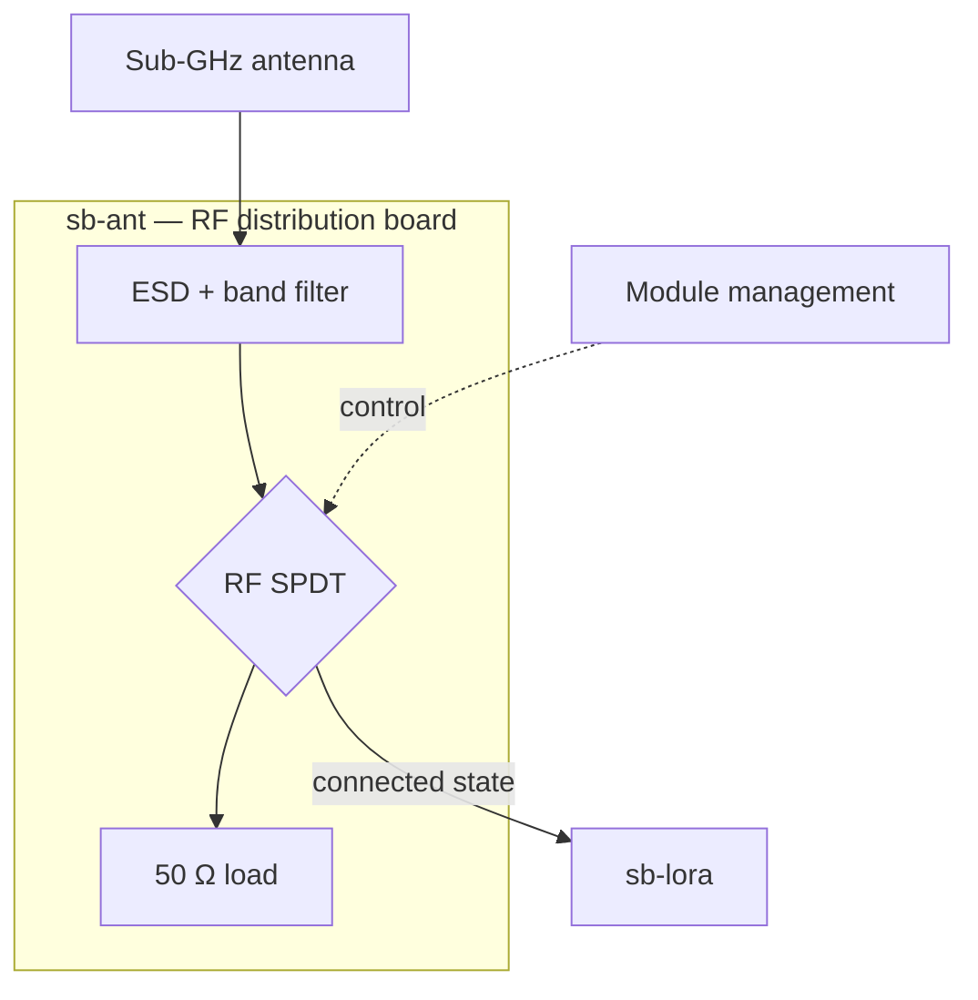
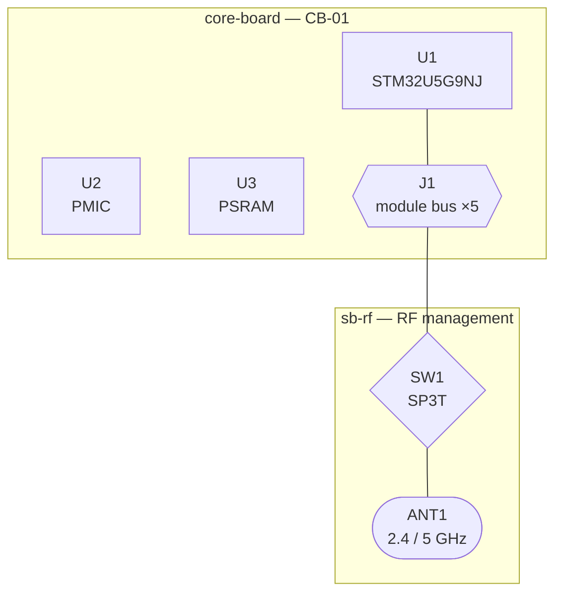

# Hardware Design Skill

This project has a deterministic pipeline at `board-layer-pipe-line/` that turns Markdown design documents into a KiCad project (.kicad_sch + .kicad_pcb + .kicad_pro). When the user is authoring design documents, evaluating an existing design, or debugging why a board didn't materialise as expected, follow the contracts below so the pipeline can do its job.

## Orientation

The pipeline runs in stages; each writes a JSON/YAML artifact into the project's `.pipeline/` directory. The key files:

| File | Written by | What it is |
|---|---|---|
| `design_artifact.deterministic.json` | Stage 0 (no LLM) | Parsed Markdown: `components` (BOM references) + `connectors` (pinout tables) + `raw_nets` |
| `bom.json` | Stage 1 (+ deterministic connector synthesis) | Canonical BOM: MPN, package, lib hints, confidence, optional `pin_map` |
| `coverage_report.json` | Stage 2 | Which BOM rows have matching KiCad library symbols/footprints |
| `gaps.json` / `gaps.md` | Stage 3 | Per-row: auto-resolved (pin_map written to BOM) or actionable user prompt |
| `nets.json` | Stage 4 | Synthesized nets with class assignment + diff-pair detection |
| `hdm.yaml` | Stage 5 | The HDM (Hardware Description Manifest) that Stage 6 compiles |
| `*.kicad_pcb/sch/pro` | Stage 6 (emitter) or `stage6-plugin` (pcbnew API) | KiCad files |
| `validation_report.json` | Stage 7 | KLC + ERC + DRC + coverage |

## Input contract — what to gather from the user before authoring design markdown

Before writing any design markdown the pipeline will consume, elicit these from the user. Don't make up defaults for things the user hasn't specified; ask once and remember.

0. **The architecture**, as a block diagram. Draw what you have understood and
   show it back before asking about details — it is faster to correct a diagram
   than to discover halfway through a BOM that two subsystems were meant to
   share an antenna. See "Block diagrams" below.
1. **Project identity**: name, board ID, dimensions in mm (width × height).
2. **Stackup**: layer count (2/4/6/8), total thickness, surface finish (HASL/ENIG/etc.).
3. **Net classes**: at minimum `Default`; typically also `Power_Bulk`, `USB3_Diff_90Ohm`, `PCIe_Diff_85Ohm`, `DDR4_Diff_90Ohm`. Each needs `trace_width`, `clearance`, `via_dia`, `via_drill` in mm. A net gets assigned to a class by regex match on its name (see `blpl/core/stage4_synthesize_nets.py`), so name nets consistently with the class you want them in.
4. **Subsystem partitioning**: list the logical subsystems (Core/Power/Network/Radio/Mechanical), and for each: which components belong to it. This becomes the refdes-naming backbone.
5. **Component list**: for each component, ask for MPN, subsystem role, and whether it's "generic" (passives, headers, USB/barrel/M.2/mini-PCIe connectors — pipeline can auto-resolve) or "specific" (FPGA, MCU, PMIC, custom IC — user must supply pinout).
6. **Refdes policy**: standard prefixes `U` (ICs), `J` (connectors), `R/C/L` (passives), `Q` (transistors), `Y` (crystals), `ANT` (antennas), `ENC` (enclosure-mechanical). Use explicit refdes like `J_USB_C`, `J_HALOW`, `J_CELL` for named connectors rather than numeric `J4`, `J7`.
7. **Pinouts for specific parts**: if the component is "specific" (FPGA/MCU/etc.), ask for a pinout table — either paste it inline or point at a datasheet page. Do not skip this step; the pipeline will halt until every specific part has a `pin_map`.

## Block diagrams — write the structure, do not describe it

**Draw the architecture as a Mermaid diagram before writing the tables.** Not as
decoration afterwards, and not instead of the tables — as the thing you and the
user agree on first, because it is the cheapest and clearest way to say what
connects to what.

Two reasons, and the second is the one people miss.

**It is a better description.** Topology is a graph. Prose about a graph is a
serialisation of it that the reader has to rebuild in their head, and every
reader rebuilds it slightly differently. "SW2 selects between the LoRa and BLE
paths on the shared 2.4 GHz antenna" is four claims wearing one sentence; drawn,
it is four edges nobody can misread.

**It costs a fraction of the context.** A real example from this project — the
RF distribution architecture, 26 blocks and 35 connections including switch
control lines, subsystem grouping and the antenna arrangement:

| form | size |
| --- | --- |
| Mermaid source | 2.1 kB (~520 tokens) |
| the SVG it renders to | 35 kB |
| an equivalent prose description | more, and less precise |

Describing that arrangement in text accurate enough to build from takes more
tokens than the diagram and still leaves the topology implicit. On a long
conversation this is the difference between the architecture staying in context
and being summarised away — and a diagram survives summarisation better than
prose, because it is already compressed.

So: when the user describes a structure, answer with a diagram. When you need to
confirm you have understood a subsystem, draw it and ask. When the architecture
changes, edit the diagram in the same proposal as the tables.

### Where they go

- **Inline in a design document**, in a ```mermaid fence, next to the prose that
  explains it. The workbench renders it in place.
- **As its own file**, `*.mmd`, for a diagram several documents refer to. These
  are editable design documents like any other: proposed as a diff, reviewed,
  committed.

### The design language

Do **not** write `classDef` lines or a theme block. The workbench appends both,
so a diagram spends its tokens on structure — which is the reason to draw one.
Classify a node and it inherits everything:



| class | shape | colour | what it means |
| --- | --- | --- | --- |
| `board` | rounded | green | A PCB. Everything sits inside one. |
| `subboard` | subroutine | emerald | A replaceable sub-board or module. |
| `mcu` | rect | violet | MCU or application processor. |
| `logic` | rect | purple | MPU, CPLD, FPGA. |
| `rf` | rect | amber | RF transceiver or radio IC. |
| `power` | trapezoid | red | PMIC, regulator, charger — anything converting power. |
| `battery` | trapezoid | lime | Cell or pack. |
| `memory` | cylinder | blue | RAM. Volatile. |
| `storage` | cylinder | sky | Flash, eMMC, SD. Non-volatile. |
| `connector` | hexagon | slate | Board-to-board, USB, headers. |
| `antenna` | stadium | orange | Antenna or RF port. |
| `rfpassive` | rhombus | yellow | Switch, combiner, filter, matching. |
| `sensor` | rect | teal | Sensors and IMUs. |
| `display` | rect | indigo | LCD, OLED, touch. |
| `audio` | rect | pink | Codec, amplifier, speaker, mic. |
| `haptic` | rect | rose | Motor, driver. |
| `passive` | rect | stone | Discretes worth naming. |
| `note` | rect | cyan | A comment, a caveat, a TBD. |

Link kinds, applied with `linkStyle` only when a diagram mixes several:

| class | colour |
| --- | --- |
| `rfPath` | amber |
| `power` | red |
| `data` | sky |
| `control` | cyan |
| `mechanical` | stone |

Two rules behind the shapes, both worth keeping:

- **No triangles and no circles.** Checked against the 109 distinct symbol
  kinds in the schematic references: a triangle is an amplifier, buffer,
  inverter, comparator or opamp, and a circle is a source, meter, lamp, motor
  or junction dot. Somebody who reads schematics all day will read them that
  way here too.
- **A plain rectangle stays a rectangle.** `ic_block`, `component_block` and
  `ic_package` are rectangles in the standards, so a rectangle meaning "an
  integrated circuit" agrees with them instead of competing.

Colours are generated from Tailwind's ramps by `mermaid/tools/palette.py`,
which refuses to emit a pair below AAA — every label is ≥7:1 on its own fill
and every border ≥3:1 on the canvas. Regenerate it; do not hand-edit the theme.

### What to write

`flowchart TB` (or `LR`) covers essentially every board-level block diagram, and
it is laid out with **ELK**, which routes orthogonally — right angles and clean
ranks rather than curves wandering across the page. The vocabulary worth
knowing:



- `A --> B` a signal or power path; `-->|label|` when the condition matters.
- `:::class` on a node to give it its meaning — `U1["U1<br/>STM32U5G9NJ"]:::mcu`.
- `-. label .->` a control or sideband line, so it reads differently from the
  path it controls.
- `{"..."}` for a switch or mux, `["..."]` for a block.
- `subgraph` for a board, a subsystem, or an enclosure boundary — the thing that
  makes a block diagram tell you where the connectors are.
- `<br/>` inside a label for a second line. Use it for port counts and
  impedances; they are what make a diagram checkable.

Name nodes with the refdes or subsystem id the BOM uses. A diagram whose blocks
are called `U_BLE` and `SB-ANT` can be checked against the tables; one whose
blocks are called "the radio" cannot.

### Two things that do not parse

Both have already cost a diagram in this app, and neither reads like a syntax
question while you are writing it. A diagram that does not parse is not drawn at
all, so each one costs the whole picture rather than a detail of it.

**Quote any label with brackets or punctuation in it.** To mermaid `(` and `)`
are grammar, not text, everywhere a label can appear:

```
DSI -->|Diff Pairs (6 pins)| PANEL       parse error
DSI -->|"Diff Pairs (6 pins)"| PANEL     works
A[Foo (bar)]                             parse error
A["Foo (bar)"]                           works
subgraph X[Foo (bar)]                    parse error
subgraph X["Foo (bar)"]                  works
```

Pin counts, impedances, package names — the details that make a diagram
checkable are the ones that carry brackets. Quote every label as a habit and the
question stops arising.

**There is no left-pointing arrow.** `-->` and `<-->` exist. `<--` does not.

```
TE <-- PANEL      parse error
PANEL --> TE      works — write the edge in the direction it flows
A <--> B          works — when it genuinely goes both ways
```

One more thing worth knowing rather than discovering: the house classes are
added to `flowchart` and `graph` only. `classDef` belongs to that grammar, and a
`sequenceDiagram` or `gantt` refuses to parse with one attached — so those kinds
render, but plainly, and `:::class` in them does nothing.

### The first diagram of a project

When somebody describes a device — "a handheld with an STM32U5G9NJ, five radio
sub-boards, a 5-inch LCD, a 5000 mAh cell, and one RF management board" — the
answer is a diagram, drawn before any table exists. It is how you show what you
understood, and it is faster to correct than a BOM is.

At that stage it is **boards and the parts worth naming**, nothing finer. No
pin-level detail, no passives, no schematic. One `subgraph` per PCB, the ICs the
user actually mentioned nested inside, connectors where boards meet, and text
designators of the kind that would be screen-printed — `SB-RF`, `U1`, `J_CORE`.
Nothing is to scale and nothing pretends to be.



Then ask what is wrong with it. That conversation is worth more than the
questions in the input contract above, because the user is correcting something
concrete rather than answering in the abstract — and what they correct tells you
which of the remaining questions still need asking.

**Do not draw what you have not established.** A diagram states connections as
facts and is far more convincing than the same guess in prose — which makes an
invented edge worse than an invented sentence. Mark what is undecided:
`SW2{"RF SPDT or SP3T<br/>TBD — depends on LR2021 pad count"}`.

## The document template — start from this, not from a blank page

Everything downstream of this file is a deterministic script. Doctor, Stage 0
and the stages after them cannot infer what you meant, ask you a question, or be
argued with: a table has the columns they look for or it is dropped on the
floor, silently, and the design continues without it. Nothing in the pipeline
gets smarter to meet a document halfway. The document has to arrive in the
shape they read.

So write it in this order, with these headings:

```markdown
# <Board name>

<A paragraph on what the board is for. Prose here is for people; no stage reads it.>

## Verified parts

| Ref | MPN | Manufacturer | Package | Pin Count | Role | Notes |
|-----|-----|--------------|---------|-----------|------|-------|
| U1 | STM32U5G9NJH6Q | STMicroelectronics | Package_BGA:TFBGA-216_13x13mm_Layout15x15_P0.8mm | 216 | Main MCU | — |

## U1 — pinout

| Pin | Signal | Function |
|---|---|---|
| A1 | VDDIO | power |

## <next refdes> — pinout
...
```

**One BOM row per component that exists.** Every refdes the board has, including
the ones that only appear in a diagram or in an architecture table: a component
without a `Ref` row does not reach Stage 1, whatever else mentions it. A table of
boards and their contents is a good thing to write, and Stage 0 discards it —
so it is a summary of the BOM, never the only place a part is named.

**A pinout heading must carry a refdes beginning `U` or `J`.** That is what
Stage 0 anchors on. `## U_CELL — pinout` and `## Connector J_USB_C — 24-pin`
both bind; `## SPKR1 — pinout`, `## CMB1 — pinout` and `## Pinout` bind to
nothing and the table is orphaned. Parts outside that naming — speakers,
combiners, switches, buzzers, loads — carry their connections in the BOM and in
net tables instead.

**Use `pinout_section` rather than writing a pinout.** It renders the extracted
pin map for a part into exactly the form above. What you type from memory is an
approximation of a datasheet; what it emits is the datasheet.

**Nothing stands in for a value inside a table — including `TBD`.** This page
said the opposite until a real design was checked against it: doctor's footprint
rule is `if ":" not in fp: continue`, so a Package cell reading `TBD` raises
nothing whatsoever, and Stage 5 lays down a placeholder in silence. A `TBD` in a
net-class row becomes a *default* trace width, which for a 50 Ω RF line or a
100 Ω differential pair is not a gap, it is a wrong answer that looks like an
answer. Prose may say a thing is undecided, and a diagram label may; a cell may
not. When a value is genuinely unknown, leave the row out and say plainly that
the project is not ready for Stage 0 and what is missing.

**Qualify a signal name that is not genuinely shared.** Two pins with the same
signal name become one net, across components. `P0.00` on both a BLE module and
a cellular SiP is two different pins and one shorted net — write `BLE_P0.00` and
`CELL_P0.00`. The same goes for `SWDIO`, `SWDCLK`, `RESET`, and every bare
`Reserved`.

**The things that are not markdown.** Board dimensions, stackup and net-class
electrical values live in `project.yaml`, not in a table — Stage 5 halts without
it. A net-class table in the document is reference material; it is read from
`project.yaml`. Run `blpl init --project-dir <p>` to build one.

**Check it before proposing it, and keep checking.** `run_doctor` reports what
each stage will do with what you wrote, including what it will silently ignore.
Every error goes before the document is proposed as finished. Then each warning
in turn: correct it, or state exactly why it is not a problem in this design and
ask the user whether to proceed with it outstanding — silence is not agreement.
As many rounds as it takes. When doctor is clean or every remaining warning has
been explicitly accepted, `check_stage0` shows what Stage 0 actually took: a
component with no pinout, or a table it ignored, is design content the pipeline
will never see. Only then is the design worth spending the LLM stages on.

## Output contract — the Markdown format Stage 0 parses

Stage 0 is deterministic. It scans for pipe-tables (`| ... |`) and classifies each as "BOM-like" or "pinout-like" by column headers. Match these shapes exactly or Stage 0 drops the table on the floor.

### BOM table

Place under a heading. Use these column names (case-insensitive; order matters):

```markdown
## BOM — Core Subsystem

| Ref | MPN | Manufacturer | Package | Pin Count | Role | Notes |
|-----|-----|--------------|---------|-----------|------|-------|
| U1  | XAZU1EG-1SBVA484I | Xilinx | BGA-484_19x19mm_P0.8mm | 484 | Main MPSoC | Zynq UltraScale+ |
| U2  | TPS65086RSMR      | TI     | QFN-48-1EP_7x7mm_P0.5mm | 48  | Zynq power sequencer | — |
```

**Required columns**: `Ref` (refdes), `MPN`, `Package`. `Pin Count`, `Manufacturer`, `Role`, `Notes` are optional but improve Stage 1 LLM accuracy and Stage 2 library lookup.

### Pinout table

One per connector/header/socket. The heading must contain the refdes as a token (so Stage 0 can associate the table to it).

```markdown
## Connector J_USB_C — USB-C receptacle (24-pin)

| Pin | Signal     | Function | Voltage |
|-----|------------|----------|---------|
| 1   | GND        | —        | 0V      |
| 2   | TX1+/RX1-  | Diff TX  | 3.3V    |
| 3   | TX1-/RX1+  | Diff TX  | 3.3V    |
| 4   | VBUS       | Supply   | 5V      |
| 5   | CC1        | Config   | 3.3V    |
| 6   | DP1        | USB2 D+  | 3.3V    |
```

Every pin gets its own row, to the last one. **Do not elide.** No `…` row, no
`| 6-24 | … |`, no "(remaining pins omitted)" — Stage 0 maps pins one to one, so
an elided row is a pin that does not exist and a range is a pin named `6-24`
that matches nothing. A 216-ball BGA gets 216 rows.

You do not have to write them. `pinout_section` renders the whole table from a
pin map already extracted from the datasheet, in exactly this format, anchored
to the refdes you give it. Call that instead of typing a pinout, and instead of
recalling one from memory — it is the difference between citing the datasheet
and approximating it.

**Required columns**: `Pin`, `Signal`. `Function` and `Voltage` are optional but used by the net classifier to suggest net classes.

## Naming conventions that matter

These aren't style preferences — they affect what the pipeline can parse.

1. **Refdes = table-heading identity**. The exact refdes that appears in the BOM (`J_USB_C`) must be the exact token in the pinout heading. `## J_USB_C Pinout` and `## Connector J_USB_C — USB-C receptacle` both work. `## USB-C connector pinout` does **not** — no refdes for Stage 0 to anchor to.
2. **Signal names are the net namespace**. Two pins on different connectors with the same signal name become one net. That is a feature for `GND`/`VCC`/etc., and a **bug** for everything else. Qualify per-subsystem: `nRF_UART0_TX`, `LORA_SPI_MOSI`, `GNSS_I2C_SDA`. Never use bare `Reserved` on more than one pin — it collides all of them into one massive net. Use `NC_J2_17`, `NC_J3_19` if a pin is genuinely unconnected.
3. **Differential pair suffixes**: `_P/_N`, `_TX_P/_TX_N`, `+/-`. The net-class classifier keys off these to assign `USB3_Diff_90Ohm`, `PCIe_Diff_85Ohm`, `DDR4_Diff_90Ohm`. Write `USB3_TX_P/USB3_TX_N`, not `USB3 TX data+/data-`.
4. **Power-rail naming**: `GND`, `VBUS`, `VCC_3V3`, `VCC_1V8`, `VCC_0V85`, `1.5V`. The regex `^\d+(\.\d+)?V` classifies these as `Power_Bulk` automatically. Don't write `3.3V RAIL` — that won't match.
5. **Package strings use KiCad library form, complete**: `Package_BGA:TFBGA-216_13x13mm_Layout15x15_P0.8mm`, `Connector_USB:USB_C_Receptacle_Amphenol_12401548E4-2A`, `Connector_FFC-FPC:Hirose_FH12-40S-0.5SH_1x40-1MP_P0.50mm_Horizontal`. Check it exists in `kicad-footprints/<Lib>.pretty/` before writing it.

   **Never abbreviate one.** A cell reading `Package_UFBGA:…_0.5mm` is a real
   entry in a real design document, written because an earlier version of this
   page used `Package_BGA:…` to mean "and so on". Stage 5 cannot tell an
   abbreviation from a name: it substitutes a generic placeholder and the board
   opens, renders and routes with the wrong copper under the part. If the
   footprint is not known yet, write `TBD` — which halts — rather than a
   shortened form, which does not.

   Modules usually have no stock footprint at all. A Raytac or Seeed module is a
   vendor land pattern, not a JEDEC package; it belongs in the project's
   `libraries/` and `TBD` is the honest entry until it is drawn.

## Known pitfalls — patterns that have broken the pipeline before

- **Grouped pin ranges**: `| 1-5 | Power |` in a pinout table prevents Stage 0 from mapping any of those pins to a refdes. Enumerate every pin individually, even when the signal is identical. Example fix: list pins 1, 2, 3, 4, 5 each on their own row.
- **Ambiguous connector heading**: `## Pinout` with no refdes makes the table orphaned. Always include the refdes.
- **Non-existent footprint MPNs**: the LLM will happily hallucinate `BarrelJack_CUI_PJ-037A_Horizontal` when only `PJ-063AH_Horizontal` exists. When citing a specific footprint, verify it's on disk first.
- **Connectors missing from the BOM table**: if a connector has a pinout table but no BOM row, it won't become a component — pipeline emits the pinout as net data only, and no footprint gets placed. Since v0.1 this is auto-fixed by `blpl/classifier/connector_synthesis.py`, but it's better to list the connector in the BOM explicitly.
- **Missing pin_map for specific parts**: FPGAs/MCUs/PMICs don't auto-classify. The pipeline will flag each as `specific_needs_user` in `gaps.md`. Resolve via `blpl resolve-pin-map --local-id U1 --csv u1_pinout.csv` or `--lib-symbol Lib:Name`.
- **A4 sheet workable area**: the PCB editor renders on an A4 landscape sheet (297 × 210 mm) with a 12.5 mm margin on three sides and a title-block notch at (176.5–284.5, 165.5–197.5) in sheet coordinates. Component placements in HDM use a board-local frame; the emitter offsets `+12.5, +12.5` automatically. Keep user-specified placements inside `[0, width-25] × [0, height-25]` to stay clear of the notch.

## Pipeline commands — quick reference

All commands run from `board-layer-pipe-line/` using the project venv (`.venv/bin/python -m pipeline.cli <command>`, or `blpl <command>` when installed).

```bash
# Stage 0 — markdown → design_artifact
blpl stage0-det --project-dir <proj>
blpl stage0-llm --project-dir <proj>                 # optional LLM pass, for comparison
blpl stage0-compare --project-dir <proj>             # diff deterministic vs LLM

# Stage 1 — LLM resolution of components + deterministic connector synthesis
blpl stage1 --project-dir <proj>
blpl stage1-synthesize-connectors --project-dir <proj>  # apply synthesis to an existing bom.json (no LLM)

# Stage 2 — library lookup
blpl stage2 --project-dir <proj>

# Stage 3 — gap-fill + classifier (passives/connectors/3-pin semis auto-resolve)
blpl stage3 --project-dir <proj>
blpl resolve-pin-map --project-dir <proj> --local-id <id> --lib-symbol <Lib:Name>   # fast path
blpl resolve-pin-map --project-dir <proj> --local-id <id> --csv <path>              # datasheet paste

# Stage 4 — net synthesis
blpl stage4 --project-dir <proj>

# Stage 5 — HDM YAML emission
blpl stage5 --project-dir <proj>

# Stage 6 — KiCad emission (two paths)
blpl stage6          --project-dir <proj>            # hand-rolled S-expr emitter (works without KiCad installed)
blpl stage6-plugin   --project-dir <proj>            # pcbnew Python API via KiCad's bundled interpreter

# Stage 7 — validation
blpl stage7 --project-dir <proj>

# Orchestrator
blpl run --project-dir <proj> --from stage0 --to stage7 [--continue-on-error]
```

## Design-review / debug mode

When the user asks "why is this board wrong?" or "what's missing in my design?", **do not regenerate markdown**. Instead:

1. Read the state under `<proj>/.pipeline/`: `bom.json`, `coverage_report.json`, `gaps.md`, `nets.json`, `hdm.yaml`, and `validation_report.json` if Stage 7 has run.
2. Cross-reference against the user's markdown source files to find where the divergence entered.
3. Produce a punch list of specific fixes (edit this row in bom.json, add this pin to this pinout table in this file, re-run this stage).

Common diagnostic paths:
- **Footprint missing at Stage 6**: check `bom.json` row's `footprint_hint` against `kicad-footprints/<Lib>.pretty/` — usually a hallucinated MPN.
- **Too few components in hdm.yaml**: check whether connectors from `design_artifact.deterministic.json` were promoted to BOM rows (run `stage1-synthesize-connectors`) and whether Stage 5 was re-run after the BOM mutated.
- **Nets not wiring**: if `hdm.yaml` has `pin_map` entries but the emitted PCB shows 0 nets on those pads, the `pin_map`'s physical pin numbers don't match the footprint's actual pad numbers. Re-resolve with `resolve-pin-map --lib-symbol` against the correct library symbol.
- **ERC unconnected pins**: expected on a freshly-emitted board; schematic wires are stubs from pin to a global label. Route on the PCB side via the plugin + pcbnew's interactive router.

## Escalation rules — when to ask the user vs auto-resolve

| Case | Rule |
|---|---|
| Passive (R/C/L/LED/fuse) | Auto-resolve — classifier picks `Device:*` + 0603 default. |
| Generic connector (barrel, USB-A/B/C, FFC, M.2, mini-PCIe, plain header) | Auto-resolve — classifier + synthesis pick `Connector:*` + default footprint. |
| SOT-23 transistor (BJT/MOSFET) | Auto-resolve — classifier uses standard GDS/BCE pin_map. |
| FPGA, MCU, PMIC, custom IC, any BGA/QFP/QFN with domain-specific pin functions | **Always** ask the user. Emit gap in `gaps.md` with the `resolve-pin-map` CLI incantation. Do not invent pin_maps from training data — it will be wrong. |
| Ambiguous package (e.g., MOSFET without package hint) | Ask the user; too many variants to guess. |

## When authoring new markdown for a project

Structure it like this (one file per subsystem, one file for overview):

```
project-root/
    dev.0X_overview_v1.md                 # project identity, stackup, net classes, block diagram
    dev.0X_subsystem-core_v1.md           # BOM table + specific-part pinouts for Core
    dev.0X_subsystem-power_v1.md          # BOM table + pinouts for Power
    dev.0X_subsystem-network_v1.md        # BOM table + connector pinouts for Network
    dev.0X_subsystem-radio_v1.md          # BOM table + connector pinouts for Radio
    dev.0X_connectors_v1.md               # Pinout tables for every J_* connector
    dev.0X_raw-nets_v1.md                 # Optional: expected net-by-net connectivity
    .pipeline/                            # Pipeline outputs (gitignored)
```

Stage 0 reads every `*.md` in the project-dir root. Keep markdown at the project root (not nested in subdirectories), or pass `--md-root` when the pipeline grows that flag.
